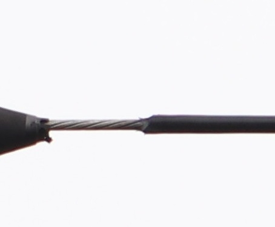

# Electrical Power Equipment Anomaly Detection

Electrical Power Equipment 데이터셋을 기반으로 PatchCore · DifferNet · ConvNeXt-B · ViT-B · ConvNeXt-B+CLAdapter · ViT-B+CLAdapter 6가지 모델 성능을 비교하는 파이프라인

## 1. 설치

```bash
conda create -n <env_name> python=3.10 -y
conda activate <env_name>
pip install -r requirements.txt
```

### 2. PT 파일 다운로드

용량 문제로 git에 포함되어 있지 않습니다. Google Drive에서 다운로드하세요.

| 항목 | Google Drive |
|---|---|
| 전선 체크포인트 | [다운로드](https://drive.google.com/drive/folders/1O1Ar2pU-PNOmDPRFU4fQLXSRyGwIM-tf) |
| 황변 체크포인트 | [다운로드](https://drive.google.com/drive/folders/1uKMpge1NRKV3J0hb5gGbKNqFDIUU2LSA) |

- checkpoints 경로 하단에 전선 체크포인트는 `checkpoints/wire_final_train/fold_9/` 황변 체크포인트는 `checkpoints/hwang_group_train/fold_9/` 로 구성되어야 합니다.
- 각 모델 폴더(`patchcore/`, `differnet/`, `linear_convnextb/`, `linear_vitb/`, `convnextb_cla_sft2/`, `vitb_cla_sft2/`) 안에 `.pt` 체크포인트 파일이 포함되어 있습니다.

---

## 3. 데이터셋 구성

데이터셋은 반드시 아래 구조로 구성되어야 합니다.

```
dataset/
├── Anomaly/   # 이상 이미지
└── Normal/    # 정상 이미지
```

모델이 정상적으로 동작하려면 **이미지가 결함 영역 기준으로 정밀하게 crop**되어야 합니다.  
전체 사진을 그대로 입력하면 성능이 크게 저하됩니다. 하단은 참고 데이터 예시입니다.

### 전선 이상탐지

| 정상 (Normal) | 이상 (Anomaly) |
|:---:|:---:|
|  |  |

### 종단접속재 황변 이상탐지

| 정상 (Normal) | 이상 (Anomaly) |
|:---:|:---:|
|  |  |

---

## 4. Inference

### 전선 이상탐지

```bash
bash wire_inference.sh --test-dir /path/to/dataset
```

### 종단접속재 황변 이상탐지

```bash
bash hwang_inference.sh --test-dir /path/to/dataset
```

`/path/to/dataset` 하위에 `Anomaly/`, `Normal/` 폴더가 있으면 Precision / Recall / F1 / AUROC 자동 계산.

### 옵션

| 옵션 | 설명 | 기본값 (wire / hwang) |
|---|---|---|
| `--test-dir` | 테스트 이미지 디렉토리 | **(필수)** |
| `--fold` | fold 번호 (0~9) 또는 `auto` | `9` |
| `--metric` | `auto` 기준 지표 (`f1` / `auroc`) | `f1` |
| `--checkpoints-dir` | 체크포인트 루트 | `wire_final_train/` / `hwang_group_train/` |
| `--split-dir` | fold CSV 디렉토리 (test split 필터링) | `splits/kfold10_..._0622/` / `splits/kfold10_..._0612_group/` |
| `--models` | 실행할 모델 (`all` 또는 콤마 구분) | `all` |
| `--output-dir` | 결과 저장 경로 | `predictions/` |

### 모델 목록

| 키 | 모델 |
|---|---|
| `patchcore` | PatchCore |
| `differnet` | DifferNet |
| `convnextb_linear` | ConvNeXt-B (linear probe) |
| `vitb_linear` | ViT-B (linear probe) |
| `convnextb_cla_sft2` | ConvNeXt-B + CLAdapter |
| `vitb_cla_sft2` | ViT-B + CLAdapter |

---

## 프로젝트 구조

```
Electrical-Power-Equipment-Anomaly-Detection/
├── src/                    # CLAdapter 모델 코드
├── inference/
│   └── inference.py        # CLAdapter 단일 모델 추론
├── baselines/
│   ├── normal_only/        # PatchCore
│   └── attent_differnet/   # DifferNet
├── checkpoints/
│   ├── wire_final_train/   # 전선 6모델 체크포인트 (fold_0 ~ fold_9)
│   └── hwang_group_train/  # 황변 6모델 체크포인트 (fold_0 ~ fold_9)
├── dataset/                # 데이터셋 (Anomaly / Normal)
├── download_checkpoints.py # 데이터셋·체크포인트 자동 다운로드
├── wire_inference.sh       # 전선 6모델 통합 inference 스크립트
├── hwang_inference.sh      # 황변 6모델 통합 inference 스크립트
├── train_kfold.sh          # CLAdapter 10-fold 학습
└── requirements.txt
```

## 전선 이상탐지 성능 (Dataset_0622, 10-Fold 평균 ± 표준편차)

| 모델 | Precision | Recall | F1 | AUROC |
|---|---|---|---|---|
| PatchCore | 84.93 ± 6.47 | 84.65 ± 6.82 | 84.78 ± 6.59 | 93.69 ± 3.76 |
| DifferNet | 86.94 ± 2.78 | 87.76 ± 2.36 | 87.34 ± 2.51 | 93.19 ± 2.90 |
| ConvNeXt-B (linear) | 97.27 ± 2.02 | 97.23 ± 2.52 | 97.24 ± 2.19 | 99.74 ± 0.35 |
| ViT-B (linear) | 99.25 ± 0.94 | 99.36 ± 0.81 | 99.30 ± 0.85 | 100.00 ± 0.00 |
| **ConvNeXt-B + CLAdapter** | **99.86 ± 0.41** | **99.78 ± 0.65** | **99.82 ± 0.53** | **100.00 ± 0.00** |
| **ViT-B + CLAdapter** | **100.00 ± 0.00** | **100.00 ± 0.00** | **100.00 ± 0.00** | **100.00 ± 0.00** |

## 종단접속재 황변 이상탐지 성능 (Dataset_0612, 10-Fold 평균 ± 표준편차)

| 모델 | Precision | Recall | F1 | AUROC |
|---|---|---|---|---|
| PatchCore | 64.33 ± 16.16 | 59.01 ± 7.89 | 60.71 ± 11.12 | 66.13 ± 13.14 |
| DifferNet | 73.41 ± 9.92 | 71.71 ± 9.77 | 72.50 ± 9.63 | 85.50 ± 7.21 |
| ConvNeXt-B (linear) | 78.77 ± 6.56 | 63.63 ± 6.47 | 70.20 ± 5.52 | 87.94 ± 4.92 |
| ViT-B (linear) | 82.93 ± 9.76 | 80.15 ± 8.58 | 81.48 ± 8.99 | 91.36 ± 8.31 |
| **ConvNeXt-B + CLAdapter** | **91.48 ± 6.11** | **91.16 ± 6.04** | **91.31 ± 6.03** | **98.03 ± 1.90** |
| **ViT-B + CLAdapter** | **93.08 ± 4.82** | **92.73 ± 6.08** | **92.88 ± 5.32** | **98.34 ± 2.28** |
